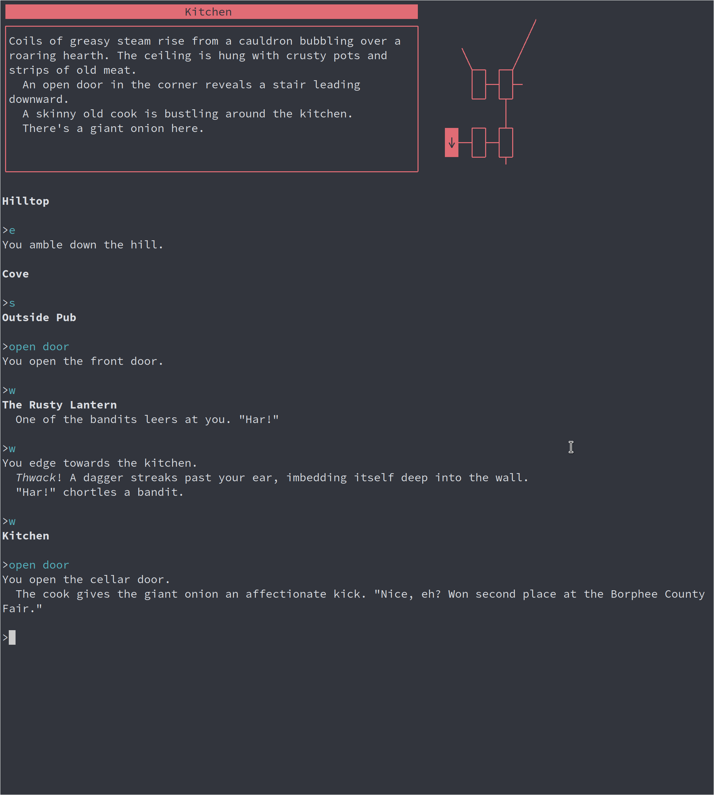

st - simple terminal
--------------------
st is a simple terminal emulator for X which sucks less.

This is my build of st, with the following patches:
* alpha
* anysize
* bold-is-not-bright
* boxdraw
* colorschemes
* scrollback
* scrollback-mouse
* scrollback-mouse-altscreen
* scrollback-reflow
* Beyond Zork font (this is a patch I created for my own use :) This allows me to play Beyond Zork within the terminal, with the character graphics font 3, with any terminal font that I want to use. See below for a screenshot of the Beyond Zork font in use -- the map and line around the window use this font. I used the boxdraw patch as inspiration when I created this patch.

Requirements
------------
In order to build st you need the Xlib header files.

Installation
------------
Edit config.mk to match your local setup (st is installed into
the /usr/local namespace by default).

Afterwards enter the following command to build and install st (if
necessary as root):

    make clean install

Running st
----------
If you did not install st with make clean install, you must compile
the st terminfo entry with the following command:

    tic -sx st.info

See the man page for additional details.

Credits
-------
Based on Aurélien APTEL <aurelien dot aptel at gmail dot com> bt source code.

